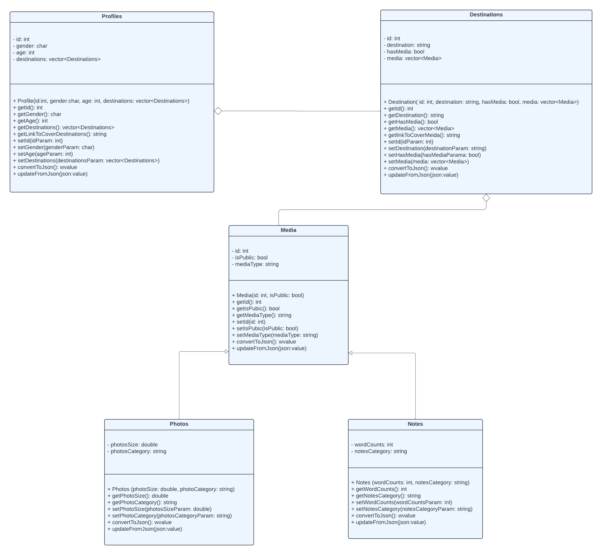

# Project Design Document

## Introduction
The Travel Map Platform is an innovative digital hub designed for avid travelers to chronicle and revisit their journeys. This interactive tool allows users to pinpoint and mark destinations they have explored, enriching these locations with personal photographs and notes. User can access, modify, and curate destination collections throguh a series of RESTful endpoitns-

## Background/Context
In the age of digital connectivity, travelers seek more than just physical experiences; they want to capture, remember, and share their journeys in a meaningful way. Traditional travel logs and social media platforms offer fragmented solutions but lack the ability to organize and revisit travel experiences in a geographical and chronological context. This web service bridges that gap by providing a platform that not only stores travel data but also presents it in an intuitive, map-based interface.

## Stakeholders
- **Travel Enthusiasts:** Individuals with a passion for travel and exploration, seeking a dedicated platform to chronicle their journeys.
- **Backpackers and Solo Travelers:** Adventurers who prefer to travel alone and desire a virtual space to maintain a digital diary that they can share.
Vacation Planners: People in the process of planning their travels who require insights from others' travel histories.
- **Developers:** The technical team that will build, maintain, and update the web service, ensuring its functionality and user-friendliness.
- **Businesses:** Local businesses and advertisers that could benefit from a targeted audience looking for travel-related services.

## Functional Requirements
1. **Personal Profile**
    - This resource is for users to manage their personal information. It supports:
    - POST: Create a personal profile with details like name, sex, and preferences.
    - GET: Retrieve profile information.
    - PUT: Update profile details.
    - DELETE: Remove a profile from the service.
2. **Destinations**
    - This resource lets users track and manage their travel:
    - POST: Add new destinations to an account.
    - GET: Access travel histories.
    - PUT: Update destination details.
    - DELETE: Delete a destination from the record.
3. **Media**
    - This resource allows users to access any social medias that relates to the specific destination like photos and notes
        - **Photos**
            - As a subtype of media, it deals with image management:
            - POST: Upload new photos.
            - GET: View uploaded photos.
            - PUT: Modify photo details.
            - DELETE: Delete photos.
        - **Notes**
            - Also a media subtype, for text management:
            - POST: Upload new notes.
            - GET: Access saved notes.
            - PUT: Update notes content.
            - DELETE: Erase notes.
4. **Actions**
    - These are general functionalities applicable to the resources:
    - Search: Find specific entries within profiles, destinations, photos, or notes.
    - Filter: Narrow down visible data based on certain criteria.
    - Sort: Arrange the data in a specific order.

5. **Data Validation**
   - The service shall enforce data validation rules to ensure that all resource data conforms to the expected formats, types, and constraints.
   - The service shall return a `400 Bad Request` status code along with error details if validation fails.

6. **Authentication and Authorization**
   - The service shall require authentication for users attempting to create, update, or delete resources.
   - The service shall authorize users based on their roles, permitting only authorized music retailers to modify or delete resource entries.

7. **Error Handling**
   - The service shall implement comprehensive error handling to provide meaningful error messages and appropriate HTTP status codes to the client for all failed operations.
   - The service shall return a `404 Not Found` status code when a requested resource cannot be located.
   - The service shall return a `500 Internal Server Error` status code in the event of unexpected server-side errors.

## Use Case Description

### Profiles
- **Create (POST)**
  - I want to create a personal profile to begin writing down my journeys, ensuring that I can revisit and update my personal details as needed for an accurate reflection of my travels.
- **Read (GET)**
  - Allow users to view their personal profile, ensuring they have access to an accurate and up-to-date reflection of their travel history.
- **Update (PUT)**
  - Provide the functionality to update personal and travel-related information in the profile, ensuring all details remain current.
- **Delete (DELETE)**
  - Offer the option to permanently delete a profile for users who wish to remove their information from the platform.

### Destinations
- **Create (POST)**
  - Allow users to add new destinations to their profile, capturing the essence of places they plan to visit or have visited.
- **Read (GET)**
  - Enable users to view detailed information about each destination, including their personal notes and experiences.
- **Update (PUT)**
  - Provide a way to update details of a destination, like changing visit dates or adding new insights post-visit.
- **Delete (DELETE)**
  - Offer the option to remove a destination from the user's profile, keeping their travel list current and relevant.

### Medias
- **Create (POST)**
  - Enable users to upload various types of media (photos, notes) associated with their travel experiences.
- **Read (GET)**
  - Allow users to access and view their uploaded media, facilitating a visual and textual recount of their journeys.
- **Update (PUT)**
  - Provide the functionality for users to update or edit their media, such as changing captions or adjusting privacy settings.
- **Delete (DELETE)**
  - Offer an option for users to delete any media item from their profile, maintaining control over their digital travel diary.

### Photos
- **Create (POST)**
  - Allow users to upload photos, capturing visual memories of their travels.
- **Read (GET)**
  - Enable users to view and browse through their collection of travel photos stored on the platform.
- **Update (PUT)**
  - Provide a feature for users to edit or update their photos, including changing size or adjusting privacy settings.
- **Delete (DELETE)**
  - Offer the ability for users to remove any photo from their profile, giving them control over their visual travel history.

### Notes
- **Create (POST)**
  - Provide users with the ability to create written notes, capturing thoughts and experiences from their travels.
- **Read (GET)**
  - Allow users to access and read their personal travel notes, reflecting on their experiences and memories.
- **Update (PUT)**
  - Enable users to edit or add to their existing notes, ensuring their reflections remain accurate and up-to-date.
- **Delete (DELETE)**
  - Offer an option to delete any specific note, allowing users to manage and curate their written travel records.

## List Of Resources

- **Profiles**
    - This resource allows users to manage their identity on the platform. Users can create their own profile and view their personal information, update their details, and delete their profile if necessary. 
- **Destinations**: 
    - Users utilize this resource to document the places they have visited. It enables users to add new destinations to their account, access their travel histories, revise existing destination details, or remove destinations from their map. It acts as the core of the travel documentation feature.
- **Medias**: 
    - A collections of medias like photos and notes
- **Photos**: 
    - As a subset of the media resources, this feature allows users to upload personal travel photos, view them in the context of their travel map, edit photo details, and delete any that they no longer wish to display. It serves to visually capture and share travel experiences.
- **Notes**: 
    - This resource complements the Photos resource as another type of media the users can manage. It is designed for users to upload textual notes, retrieve them, edit their content, and delete them. Notes provide a narrative element to the travel experience, allowing for detailed personal recollections and tips.
 
     

    
## List of End Points

### Profiles 
- **POST** `/api/profiles`
    - **Description**: Create a new profile.
    - **Request BODY**: `{"id": 1, "gender": "F", “age”: 20}`
    - **Response**: `201 Created` with the created profile object in the body.
    - **Error**: `400 Bad Request` if input validation fails.

- **GET** `/api/profiles`
    - **Description**: Retrieve a list of all profiles.
    - **Response**: `200 OK` with an array of profiles objects in the body.

- **GET** `/api/profiles/{id}`
  - **Description**: Retrieve details of a specific profile.
  - **Response**: `200 OK` with the profiles object in the body.
  - **Error**: `404 Not Found` if the profiles does not exist.

- **PUT** `/api/profiles/{id}`
  - **Description**: Update an existing profiles.
  - **Request BODY**: `{"id": 1, "gender": "F", “age”: 20}`
  - **Response**: `200 OK` with the updated profile object in the body.
  - **Error**: `400 Bad Request` if input validation fails; `404 Not Found` if the profile does not exist.

- **DELETE** `/api/profiles/{id}`
  - **Description**: Delete a specific profile.
  - **Response**: `204 No Content`.
  - **Error**: `404 Not Found` if the profile does not exist; `403 Forbidden` if the user is unauthorized.

### Destinations

- **POST** `/api/destinations`
    - **Description**: Create a new destination.
    - **Request BODY**: `{ "id" = 1, "destination": "string", “mediaName”: “media”}`
    - **Response**: `201 Created` with the created destination object in the body.
    - **Error**: `400 Bad Request` if input validation fails.

- **GET** `/api/destinations`
    - **Description**: Retrieve a list of all destinations.
    - **Response**: `200 OK` with an array of destinations objects in the body.

- **GET** `/api/destinations/{id}`
  - **Description**: Retrieve details of a specific destination.
  - **Response**: `200 OK` with the destinations object in the body.
  - **Error**: `404 Not Found` if the destinations does not exist.

- **PUT** `/api/destinations/{id}`
  - **Description**: Update an existing destination.
  - **Request BODY**: `{"id": 1, "gender": "F", “age”: 20}`
  - **Response**: `200 OK` with the updated destination object in the body.
  - **Error**: `400 Bad Request` if input validation fails; `404 Not Found` if the destination does not exist.

- **DELETE** `/api/destinations/{id}`
  - **Description**: Delete a specific destination.
  - **Response**: `204 No Content`.
  - **Error**: `404 Not Found` if the destination does not exist; `403 Forbidden` if the user is unauthorized.

### Media

- **POST** `/api/media`
    - **Description**: Create a new media.
    - **Request BODY**: `{"id":1, "isPublic": false, "mediaType":"Photos"}`
    - **Response**: `201 Created` with the created media object in the body.
    - **Error**: `400 Bad Request` if input validation fails.

- **GET** `/api/media`
    - **Description**: Retrieve a list of all media.
    - **Response**: `200 OK` with an array of media objects in the body.

- **GET** `/api/media/{id}`
  - **Description**: Retrieve details of a specific media.
  - **Response**: `200 OK` with the media object in the body.
  - **Error**: `404 Not Found` if the media does not exist.

- **PUT** `/api/media/{id}`
  - **Description**: Update an existing media.
  - **Request BODY**: `{"id":1, "isPublic": false, "mediaType":"Photos"}`
  - **Response**: `200 OK` with the updated media object in the body.
  - **Error**: `400 Bad Request` if input validation fails; `404 Not Found` if the media does not exist.

- **DELETE** `/api/media/{id}`
  - **Description**: Delete a specific media.
  - **Response**: `204 No Content`.
  - **Error**: `404 Not Found` if the media does not exist; `403 Forbidden` if the user is unauthorized.

### Photos

- **POST** `/api/photos`
    - **Description**: Create a new photos.
    - **Request BODY**: `{"photosSize":1.5, "photosCategory":"Screenshot", "mediaType":"Photos", "isPublic":false, "id":7}`
    - **Response**: `201 Created` with the created photos object in the body.
    - **Error**: `400 Bad Request` if input validation fails.

- **GET** `/api/photos`
    - **Description**: Retrieve a list of all photos.
    - **Response**: `200 OK` with an array of photos objects in the body.

- **GET** `/api/photos/{id}`
  - **Description**: Retrieve details of a specific photos.
  - **Response**: `200 OK` with the photos object in the body.
  - **Error**: `404 Not Found` if the photos does not exist.

- **PUT** `/api/photos/{id}`
  - **Description**: Update an existing photos.
  - **Request BODY**: `{"photosSize":1.5, "photosCategory":"Screenshot", "mediaType":"Photos", "isPublic":false, "id":7}`
  - **Response**: `200 OK` with the updated photos object in the body.
  - **Error**: `400 Bad Request` if input validation fails; `404 Not Found` if the photos does not exist.

- **DELETE** `/api/photos/{id}`
  - **Description**: Delete a specific photos.
  - **Response**: `204 No Content`.
  - **Error**: `404 Not Found` if the photos does not exist; `403 Forbidden` if the user is unauthorized.

### Notes

- **POST** `/api/notes`
    - **Description**: Create a new note.
    - **Request BODY**: `{ "id" = 1, "note": "string", “mediaName”: “media”}`
    - **Response**: `201 Created` with the created note object in the body.
    - **Error**: `400 Bad Request` if input validation fails.

- **GET** `/api/notes`
    - **Description**: Retrieve a list of all notes.
    - **Response**: `200 OK` with an array of notes objects in the body.

- **GET** `/api/notes/{id}`
  - **Description**: Retrieve details of a specific note.
  - **Response**: `200 OK` with the notes object in the body.
  - **Error**: `404 Not Found` if the notes does not exist.

- **PUT** `/api/notes/{id}`
  - **Description**: Update an existing note.
  - **Request BODY**: `{"id": 1, "gender": "F", “age”: 20}`
  - **Response**: `200 OK` with the updated note object in the body.
  - **Error**: `400 Bad Request` if input validation fails; `404 Not Found` if the note does not exist.

- **DELETE** `/api/notes/{id}`
  - **Description**: Delete a specific destination.
  - **Response**: `204 No Content`.
  - **Error**: `404 Not Found` if the destination does not exist; `403 Forbidden` if the user is unauthorized.

## UML Diagrams

